# 🐣 S1 | Prog: Workshop (Solution)

- [📅 Planning](#-planning)
  - [Lundi](#lundi)
    - [Prof 9h30-12h45 (pause 11h00-11h15)](#prof-9h30-12h45-pause-11h00-11h15)
    - [Élève](#élève)
  - [Mardi](#mardi)
    - [Matin 9h30-12h45 (pause 11h00-11h15)](#matin-9h30-12h45-pause-11h00-11h15)
      - [Prof](#prof)
      - [Élève](#élève-1)
    - [Aprèm](#aprèm)
      - [Prof 13h45-17h (pause 15h15-15h30)](#prof-13h45-17h-pause-15h15-15h30)
      - [Élève](#élève-2)
  - [Mercredi](#mercredi)
    - [Prof 9h30-10h30](#prof-9h30-10h30)
    - [Élève](#élève-3)
  - [Jeudi](#jeudi)
    - [Prof 9h30-10h30](#prof-9h30-10h30-1)
    - [Élève](#élève-4)
  - [Vendredi](#vendredi)
    - [Matin 9h30-10h30](#matin-9h30-10h30)
      - [Prof](#prof-1)
      - [Élève](#élève-5)
    - [Aprèm 13h45-17h (pause 15h15-15h30)](#aprèm-13h45-17h-pause-15h15-15h30)
- [📝 Sujet](#-sujet)
  - [Exercices à faire](#exercices-à-faire)
  - [Rapport](#rapport)
  - [Soutenance](#soutenance)
- [💻 Exercices](#-exercices)
  - [Conseils](#conseils)
  - [⭐ Ne garder que le vert](#-ne-garder-que-le-vert)
  - [⭐ Échanger les canaux](#-échanger-les-canaux)
  - [⭐ Noir \& Blanc](#-noir--blanc)
  - [⭐ Négatif](#-négatif)
  - [⭐ Dégradé](#-dégradé)
  - [⭐⭐ Miroir](#-miroir)
  - [⭐⭐ Image bruitée](#-image-bruitée)
  - [⭐⭐ Rotation de 90°](#-rotation-de-90)
  - [⭐⭐ RGB split](#-rgb-split)
  - [⭐⭐ Luminosité](#-luminosité)
  - [⭐⭐ Disque](#-disque)
    - [⭐ Cercle](#-cercle)
    - [⭐⭐⭐ Rosace](#-rosace)
  - [⭐⭐ Mosaïque](#-mosaïque)
    - [⭐⭐⭐ Mosaïque miroir](#-mosaïque-miroir)
  - [⭐⭐⭐ Glitch](#-glitch)
  - [⭐⭐⭐ Fractale de Mandelbrot](#-fractale-de-mandelbrot)
  - [⭐⭐⭐ Vortex](#-vortex)
  - [⭐⭐⭐(⭐) Tramage](#-tramage)
  - [⭐⭐⭐(⭐) Normalisation de l'histogramme](#-normalisation-de-lhistogramme)
  - [⭐⭐⭐⭐ Convolutions](#-convolutions)
    - [⭐ Netteté, Contours, etc.](#-netteté-contours-etc)
    - [⭐⭐ Filtres séparables](#-filtres-séparables)
    - [⭐⭐ Différence de gaussiennes](#-différence-de-gaussiennes)
  - [⭐⭐⭐⭐ Tri de pixels](#-tri-de-pixels)
  - [⭐⭐⭐⭐⭐ Filtre de Kuwahara (effet peinture à l'huile)](#-filtre-de-kuwahara-effet-peinture-à-lhuile)
  - [⭐⭐⭐⭐⭐ K-means : trouver les couleurs les plus présentes dans une image](#-k-means--trouver-les-couleurs-les-plus-présentes-dans-une-image)
  - [⭐⭐⭐⭐⭐⭐ Diamond Square](#-diamond-square)
    - [⭐⭐ Colorer la height map](#-colorer-la-height-map)
  - [Vous pouvez implémenter vos propres effets !](#vous-pouvez-implémenter-vos-propres-effets-)

## 📅 Planning

### Lundi

#### Prof 9h30-12h45 (pause 11h00-11h15)

- [ ] Présentation de moi
- [ ] Présentation du projet
  - [ ] C'est quoi le sujet? -> faire des effets sur les images, comme on peut en trouver dans photoshop, filtre insta etc
  - [ ] Par groupe de 2, et 1 groupe de 3 si impair. Mais je veux que vous fassiez chacun des exercices de votre côté autant que possible, et que vous vous entraidiez au besoin. À partir des exercice de niveau 3 ou + vous pouvez bosser à deux dessus dès le début.
  - [ ] Évaluation: min 1 exo de niveau 3 ou +, et autant du reste que possible. Montrez moi juste que vous êtes investies, 4h d'autonomie par jour c'est très bien. Posez un max de question, quand vous êtes bloquées et/ou par curiosité.
  - [ ] Je vous encourage à dans un premier temps essayer de faire chaque exercice sans regarder les indices, ni chercher sur internet / ChatGPT. Essayez de résoudre le problème par vous-même, ça aide à mieux le comprendre, puis apprécier et retenir la solution. + si vous réussissez seul.e, giga satisfaction. Les exos sont "faciles", c'est fait pour. Bien sûr que ChatGPT peut les résoudre, mais vous n'apprendrez rien si vous n'essayez pas par vous même. Et plutôt que ChatGPT, demandez moi en premier si possible, je pourrai mieux vous aiguiller / expliquer juste comme il faut pour que vous appreniez un max. Ou sinon demandez à vos camarades en deuxième solution (+ c'est un bon exercice d'expliquer donc vous rendez service à la fois à vous-même et à elleux)   
- [ ] Présentation de la lib
  - [ ] Parler de la représentation des couleurs en vec3 avec des valeurs de 0 à 1
  - [ ] Mentionner que pour faire les choses bien il ne faudrait pas travailler en sRGB mais dans un espace perceptuellement correct (CIELab, Oklab)
  - [ ] Mentionner que la lib n'est pas un exemple de la meilleure API de l'univers, elle est minimaliste pour les forcer à écrire un max de code, se rendre compte des problèmes qui peuvent survenir, pas trop leur mâcher le travail. (Par exemple, on devrait permettre de gérer un wrap mode, et faire les conversions d'espace de couleur automatiquement, et pouvoir itérer sur les lignes ou sur les colonnes, et aussi le fait que le chemins soient relatifs au dossier contenant le CMakeLists.txt c'est atroce en production)

#### Élève

- [ ] Création du groupe : binôme obligatoirement (et 1 trinôme dans la classe si impair) mais je veux que vous fassiez chacun des exercices de votre côté autant que possible, et que vous vous entraidiez au besoin. À partir des exercice de niveau 3 ou + vous pouvez bosser à deux dessus dès le début.
- [ ] Prise en main de la lib
- [ ] Quelques exercices de niveau 1 (⭐) et/ou 2 (⭐⭐)

### Mardi

#### Matin 9h30-12h45 (pause 11h00-11h15)

##### Prof

- [ ] Présentation de git

##### Élève

- [ ] Création du git
- [ ] Test et prise en main de git (l'un push quelque chose et l'autre le pull par exemple)
- [ ] Mettre sur le repository les exercices que vous avez fait hier

#### Aprèm

##### Prof 13h45-17h (pause 15h15-15h30)

- [ ] Lancement des algos avancés (niveau 3 ou plus ⭐⭐⭐), accompagnement, conseils

##### Élève

- [ ] Choix de l'algo que vous allez implémenter (niveau 3 ou plus ⭐⭐⭐)
- [ ] Commencer à vous renseigner sur votre algo avancé, à l'implémenter

### Mercredi

#### Prof 9h30-10h30

- [ ] Si besoin, point de rappel sur une notion mal acquise.
- [ ] Passer voir les groupes, regarder l'algo avancé qu'iels ont choisi.


#### Élève

- [ ] Avancer sur l'algo avancé

### Jeudi

#### Prof 9h30-10h30

- [ ] Si besoin, point de rappel sur une notion mal acquise.
- [ ] Passer voir les groupes et décider qui présente quel algo. Possibilité que plusieurs groupes se mettent ensemble pour présenter leur algo si tout le monde a envie de passer.

#### Élève

- [ ] Finir votre algo avancé

### Vendredi

#### Matin 9h30-10h30

##### Prof

- [ ] Présentation de Markdown pour l'écriture du rapport
  - [ ] Extension VSCode, et comment elle permet de générer une Table of Content
  - [ ] Syntaxe basique (titres, gras, italique, blocs de code, bloc quote, liste), et si voulez vous pouvez aller voir comment [le document que vous êtes en train de lire](TODO mettre le lien du sujet qui est sur le git) est écrit, c'est du markdown !
  - [ ] [Cheatsheet](https://github.com/adam-p/markdown-here/wiki/Markdown-Cheatsheet)
  - [ ] Mettre des images (s'assurer du coup que leur dossier output soit à la racine du repo, et soit commit)
  - [ ] Vous pouvez mettre du html si vous voulez faire des trucs + avancés.

##### Élève

- [ ] Écriture du rapport. (Vous avez jusqu'à lundi matin pour les rendre).
- [ ] Préparation de la présentation pour celleux concerné.es

#### Aprèm 13h45-17h (pause 15h15-15h30)

- [ ] Présentations


## 📝 Sujet

### Exercices à faire

Faites un maximum de chose, et au minimum un exercice de niveau 3 ou plus (⭐⭐⭐). Vous êtes aussi les bienvenu.es pour inventer vos propres effets !

### Rapport

À faire en Markdown obligatoirement (si vous ne connaissez pas c'est l'occasion de découvrir, c'est super utile).

À mettre directement en tant que ReadMe à la racine du repo.

Faites une section par exercice que vous avez fait. Montrez une image avant et après application de l'effet (comme c'est fait dans l'énoncé des exercices). Si vous jugez cela utile, vous pouvez mettre un petit texte expliquant des spécificités de l'algo que vous avez implémenté. (C'est surtout intéressant si vous avez fait des algos qui ne sont pas listés dans le sujet, et pour vos algo 3+).

Mettez un lien vers votre git au début du rapport.

### Soutenance

Présentez un des algos avancés que vous avez fait, en 5-10 minutes. C'est de la vulgarisation, il faut que tous vos camarades puissent comprendre, au moins dans les grandes lignes.

## 💻 Exercices

### Conseils

- Nous utiliserons la librairie *sil* pour lire, éditer et sauvegarder les images. Elle est très simple à utiliser et n'expose que le minimum nécessaire. Vous pouvez trouver sa documentation [sur GitHub](https://github.com/JulesFouchy/Simple-Image-Lib/tree/main#usage).
- Utilisez des images relativement petites (500x500 max), pour que le rendu soit quasi-instantané. Au moins pendant que vous faites vos tests.
- Vous pouvez afficher l'image de sortir à côté dans VSCode pour facilement voir le résultat:
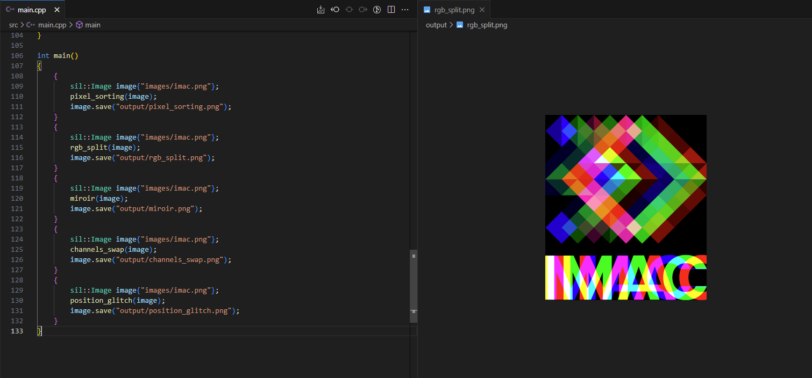

### ⭐ Ne garder que le vert


<details><summary>Indice</summary>

Mettre le rouge et le bleu à 0.
</details>

### ⭐ Échanger les canaux


Par exemple, échangez le canal rouge et le canal bleu.

<details><summary>Indice</summary>

Il existe `std::swap(a, b)` pour échanger deux valeurs.
</details>

### ⭐ Noir & Blanc


<details><summary>Indice</summary>

N'hésitez pas à **aller chercher la formule sur internet** si besoin !
</details>

### ⭐ Négatif


<details><summary>Indice</summary>

Il faut trouver une formule simple, qui transforme le noir en blanc et le blanc en noir (i.e. qui transforme 0 en 1 et 1 en 0).
</details>

### ⭐ Dégradé


> Vous pouvez créer une image noire avec
> ```cpp
> sil::Image image{300/*width*/, 200/*height*/};
> ```
> puis itérer sur les pixels pour les colorer.

<details><summary>Indice</summary>

La couleur de chaque pixel doit dépendre de son x uniquement.
</details>

<details><summary>Indice 2</summary>

Quelle formule permettrait d'avoir 0 (noir) quand x vaut 0 (gauche), et 1 (blanc) quand x vaut `image.width() - 1` (droite).
</details>

### ⭐⭐ Miroir


<details><summary>Indice</summary>

Il va falloir parcourir la moitié gauche de l'image, et l'échanger avec la partie droite de l'image.
</details>

### ⭐⭐ Image bruitée

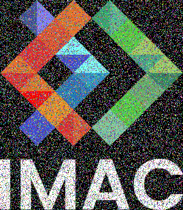

<details><summary>Indice</summary>

Remplacer quelques pixels au hasard par une couleur aléatoire.
</details>

*Info:*
> Pour obtenir des nombres aléatoires, includez le fichier `"random.hpp"` et utilisez soit `random_int(min, max)` soit `random_float(min, max)`. Si vous voulez que votre programme utilise les mêmes nombres aléatoires à chaque fois que vous l'utilisez, vous pouvez définir une seed avec `set_random_seed(0)` au début de votre `main()` (vous pouvez passer n'importe quel nombre autre que 0, ça définira quels seront les nombres générés par les fonctions random).

### ⭐⭐ Rotation de 90°


La formule générique pour un angle quelconque est un peu plus compliquée, mais pour 90° il y a une formule vraiment simple, essayez de la trouver !

### ⭐⭐ RGB split


<details><summary>Indice</summary>

Chaque pixel va prendre comme couleur le rouge d'un pixel un peu à sa droite, son propre vert, et le bleu d'un pixel un peu à sa gauche.
</details>

<details><summary>⚠️ Piège à ne pas tomber dedans</summary>

Créez une nouvelle image et travaillez sur celle-ci. Il ne faut pas modifier l'image originale pendant que vous bouclez pour appliquer l'effet, sinon certains pixels n'utiliseront pas la bonne couleur de l'image originale, mais plutôt la couleur déjà modifiée par un pixel précédent, ce qui pourrait vous donner ce genre de rendu moins intéressant :

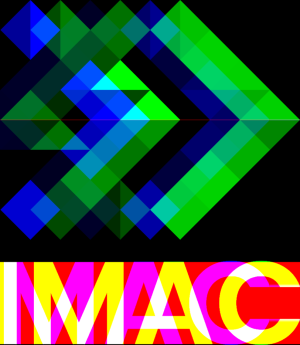
</details>

### ⭐⭐ Luminosité

|   |   |  |
|---|----|----|
| Image originale | Après éclaircissement | Après assombrissement |

<details><summary>Indice</summary>

On voudrait des courbes comme celles-ci, qui diminuent tous les nombres entre 0 et 1 (courbe bleue) (c-à-d assombrisse), ou les augmentent (courbe verte) (c-à-d éclaircisse), tout en gardant 0 à 0 et 1 à 1 (afin de garder la plage dynamique de l'image, pour conserver des noirs purs et des blancs purs).
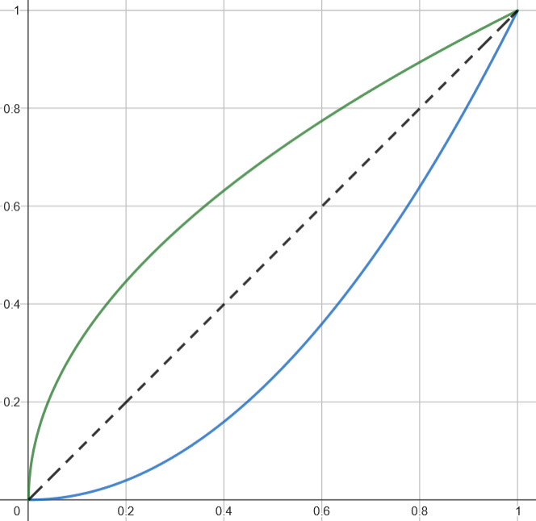
</details>
<details><summary>Indice 2</summary>

Les fonctions puissance font exactement ce qu'on veut!
La preuve: https://www.desmos.com/calculator/c3ztk51mng
</details>

### ⭐⭐ Disque

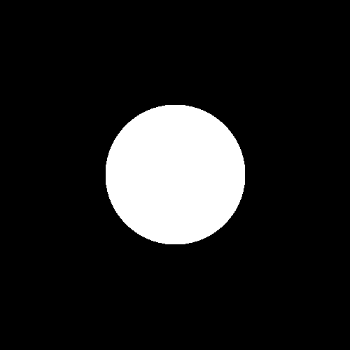

> Vous pouvez créer une image noire avec
> ```cpp
> sil::Image image{500/*width*/, 500/*height*/};
> ```
> puis itérer sur les pixels pour les colorer.

<details><summary>Indice</summary>

Quelle est l'équation d'un disque ? Comment peut on s'en servir pour savoir si un pixel est à l'intérieur ou à l'extérieur du disque ?
</details>

#### ⭐ Cercle

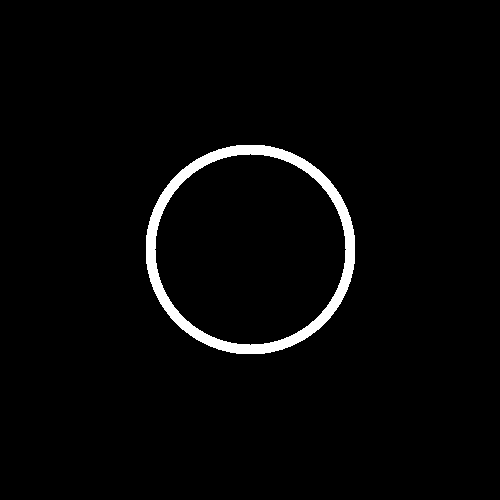

En reprenant et modifiant légèrement votre code pour le disque, écrivez le code qui donne un cercle. (Son contour aura une épaisseur donnée `thickness`).

#### ⭐⭐⭐ Rosace

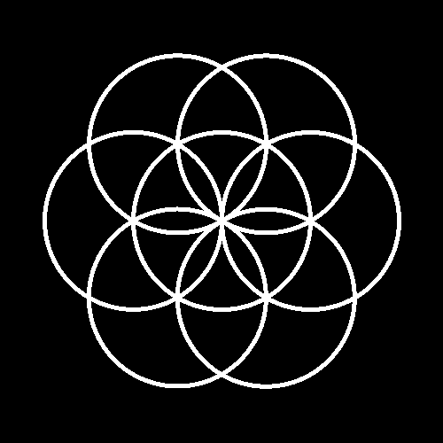

Maintenant que vous savez dessiner un cercle, dessinez-en plusieurs sur la même image, à des positions bien choisies, de sorte à dessiner une rosace.
(PS: il va sûrement falloir faire de la trigo!)

<details><summary>Indice</summary>

Comment passer de coordonnées polaires (angle et rayon) à des coordonnées cartésiennes (x et y) ?
</details>

### ⭐⭐ Mosaïque

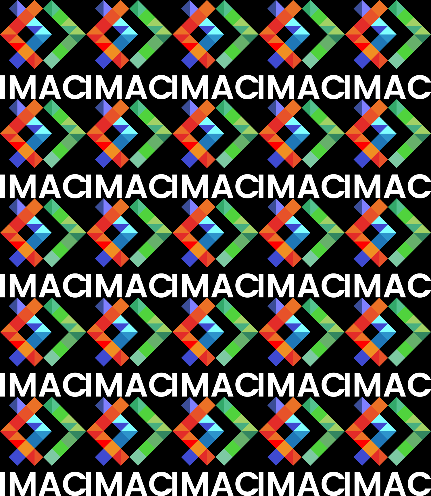

<details><summary>Indice</summary>

Une manière concise de faire ça est d'utiliser un modulo (`%`) quelque part.
</details>

#### ⭐⭐⭐ Mosaïque miroir

Inversez une image sur deux :


### ⭐⭐⭐ Glitch


<details><summary>Indice</summary>
Prendre un rectangle de pixels et l'intervertir avec un autre rectangle de pixels, ailleurs dans l'image. Faire ça plusieurs fois.
</details>

*Info:*
> Pour obtenir des nombres aléatoires, includez le fichier `"random.hpp"` et utilisez soit `random_int(min, max)` soit `random_float(min, max)`. Si vous voulez que votre programme utilise les mêmes nombres aléatoires à chaque fois que vous l'utilisez, vous pouvez définir une seed avec `set_random_seed(0)` au début de votre `main()` (vous pouvez passer n'importe quel nombre autre que 0, ça définira quels seront les nombres générés par les fonctions random).

### ⭐⭐⭐ Fractale de Mandelbrot

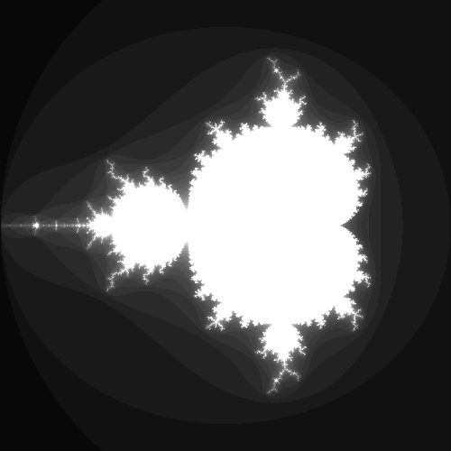

La fractale de Mandelbrot s'obtient ainsi: pour chaque nombre complexe `c`, on initialise un autre nombre complexe `z` à 0, puis on itère `z = z * z + c` un certain nombre de fois. Si le nombre `z` commence à devenir de plus en plus grand, alors `c` ne fait pas partie de la fractale et on colorie le pixel correspondant en noir. À l'inverse, si `z` reste de taille modérée peu importe le nombre d'itérations qu'on fait, alors le pixel fait partie de la fractale et on le colorie en blanc.

Plus précisément, on peut prouver que dès que `std::abs(z) > 2` alors le nombre `z` va forcément finir par grandir de plus en plus. On peut donc s'arrêter d'itérer dès que `std::abs(z) > 2`. Et pour obtenir une fractale plus jolie, plutôt que d'assigner du noir pur on peut assigner un gris plus ou moins sombre en fonction du nombre d'itérations qu'il a fallu faire avant que `std::abs(z) > 2`.

Conseil: si vous mappez directement le pixel (x, y) au nombre complexe x + i * y, vous allez visualiser les nombres complexes entre 0 et 500, et votre fractale va être beaucoup trop petite. Les nombres intéressants sont plutôt entre -2 et 2. Il va donc falloir appliquer une petite transformation à votre x et y pour les faire rentrer dans cet intervalle.

Conseil: vous pouvez inclure le header `<complex>` pour utiliser des nombres complexes. Un nombre complexe se définit comme ça:
```cpp
#include <complex>
int main()
{
    std::complex<float> z{3.f, 2.f}; // Définis le nombre z = 3 + 2*i
}
```
et s'utilise comme un nombre normal: vous pouvez faire des additions, multiplications etc.

> Vous pouvez créer une image noire avec
> ```cpp
> sil::Image image{500/*width*/, 500/*height*/};
> ```
> puis itérer sur les pixels pour les colorer.

### ⭐⭐⭐ Vortex

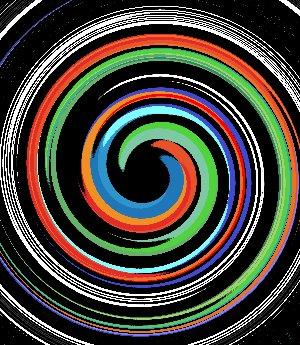

*Info:*
> Pour appliquer une rotation à un `glm::vec2` vous pouvez utiliser
> ```cpp
> glm::vec2 rotated(glm::vec2 v, float angle)
> {
>     return glm::vec2{glm::rotate(glm::mat3{1.f}, angle) * glm::vec3{v, 0.f}};
> } 
> ```

<details><summary>Indice</summary>
Chaque pixel subit une rotation, de plus en plus importante au fur et à mesure qu'on s'éloigne du centre.
</details>

### ⭐⭐⭐(⭐) Tramage


Vous pouvez lire [ce super article](https://surma.dev/things/ditherpunk/) sur le tramage (a.k.a. *dithering* en anglais).

Sur l'image ci-dessus j'ai utilisé de l'*ordered dithering* avec une matrice de Bayer 4x4 (a.k.a. de niveau 1). Tout est expliqué dans l'article ci-dessus ! (Plus précisément, j'ai repris la matrice et le code depuis [cet autre article](https://medium.com/the-bkpt/dithered-shading-tutorial-29f57d06ac39).)

### ⭐⭐⭐(⭐) Normalisation de l'histogramme

|   |   |
|---|----|
| Avant | Après |

L'algorithme consiste à trouver le pixel le moins lumineux et le pixel le plus lumineux de l'image, puis à appliquer une transformation à chaque pixel de sorte à ce que le pixel le plus sombre devienne un noir pur (0) et le plus lumineux devienne un blanc pur (1).
(PS: testez avec l'image `"images/photo_faible_contraste.jpg"`, vous verrez bien l'intérêt de l'effet.)

### ⭐⭐⭐⭐ Convolutions


*Box blur*

Les convolutions permettent d'implémenter plein d'effets (flou, détection de contour, augmentation de la netteté, etc.). L'effet va varier en fonction du *kernel* que vous utilisez lors de votre convolution. Tout est expliqué dans cette excellente vidéo, entre 1m10 et 4m18:

[](https://www.youtube.com/watch?v=8rrHTtUzyZA)

Conseil: une fois que vous savez que votre algo marche, si vous voulez tester avec des kernels plus gros, ça peut être lent, donc vous avez intérêt à build en release et lancer sans debugger attaché (demandez-moi si vous ne savez pas comment faire).

#### ⭐ Netteté, Contours, etc.

|   |   |  |
|---|----|----|
| Emboss | Outline | Sharpen |

Une fois que vous avez implémenté l'algo générique de convolution qui prend n'importe quel kernel, vous pourrez trouver sur [ce site](https://setosa.io/ev/image-kernels/) une liste de kernels pour faire différents effets.

#### ⭐⭐ Filtres séparables

| Box blur naïf, 100x100  | Box blur séparé, 100x100 |
|---|----|
| 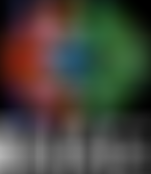 |  |
| 7.44 secondes | 0.18 secondes |

Quand vous voulez faire un gros flou il faut augmenter la taille du kernel, ce qui peut considérablement ralentir l'algorithme. Heureusement, certains kernels ont une propriété qui nous permet de calculer leur convolution **BEAUCOUP** plus rapidement. Le *box blur* et le *gaussian blur* sont de tels kernels. Voici une vidéo expliquant tout ça :

[](https://www.youtube.com/watch?v=SiJpkucGa1o)

#### ⭐⭐ Différence de gaussiennes

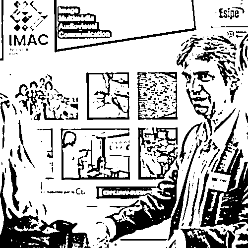

Voici une vidéo expliquant l'algorithme:

- **NB 1:** Il parle de flou gaussien, mais vous pouvez tout aussi bien réutiliser votre box blur, pas la peine d'implémenter un flou gaussien.
- **NB 2:** Ne faire que l'algo de base, présenté jusqu'à 4m09. Après ça ça devient très compliqué (mais très stylé néanmoins).

[](https://www.youtube.com/watch?v=5EuYKEvugLU)

### ⭐⭐⭐⭐ Tri de pixels

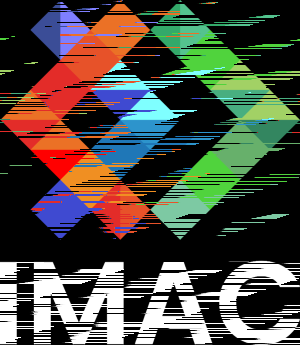

Voici une bonne vidéo expliquant l'algorithme (vous pouvez ignorer le début spécifique à Processing où on voit comment afficher l'image) :

[](https://www.youtube.com/watch?v=JUDYkxU6J0o)

Utilisez `image.pixels()` pour récupérer le tableau contenant tous les pixels de l'image et le trier.

Ensuite, au lieu de trier tous les pixels de l'image, triez par colonne (ou par ligne) pour un effet plus joli. (Il faudra trier des sous-parties du tableau `image.pixels()`.) Ou encore, triez des sous-parties prises aléatoirement dans l'image.

*Info:*
> Pour trier un tableau, vous pouvez utiliser `std::sort`. La fonction s'utilise ainsi:
> ```cpp
> std::vector<int> v{8, 5, 3, 1};
> std::sort(v.begin(), v.end()); // Trie un tableau du début à la fin
> // {1, 3, 5, 8}
> ```
> ```cpp
> std::vector<int> v{8, 5, 3, 1};
> std::sort(v.begin(), v.begin() + 2); // Trie les deux premiers éléments du tableau, c'est comme si on lui avait passé le tableau {8, 5}
> // {5, 8, 3, 1}
> ```
> ```cpp
> std::vector<int> v{8, 5, 3, 1};
> std::sort(v.begin() + 1, v.begin() + 3); // Trie le sous-tableau {5, 3}
> // {8, 3, 5, 1}
> ```
> Et vous pouvez aussi choisir selon quel ordre les éléments seront triés :
> ```cpp
> std::vector<glm::vec3> v{/*...*/};
> std::sort(v.begin(), v.end(), [](glm::vec3 const& color1, glm::vec3 const& color2)
> {
>     return color1.r < color2.r; // Trie selon la composante rouge
> });
> ```
> ```cpp
> std::vector<glm::vec3> v{/*...*/};
> std::sort(v.begin(), v.end(), [](glm::vec3 const& color1, glm::vec3 const& color2)
> {
>     return brightness(color1) < brightness(color2); // Trie selon la luminosité des couleurs (NB : c'est à vous de coder la fonction `brightness`)
> });
> ```
> On passe ce qu'on appelle une *lambda* en 3ème argument : c'est une fonction définie en plein milieu du code. Elle doit prendre en paramètre deux éléments du tableau (deux `vec3` en l'occurrence) et retourner un booléen indiquant qui est le plus petit des deux éléments.

*Info:*
> Pour obtenir des nombres aléatoires, includez le fichier `"random.hpp"` et utilisez soit `random_int(min, max)` soit `random_float(min, max)`. Si vous voulez que votre programme utilise les mêmes nombres aléatoires à chaque fois que vous l'utilisez, vous pouvez définir une seed avec `set_random_seed(0)` au début de votre `main()` (vous pouvez passer n'importe quel nombre autre que 0, ça définira quels seront les nombres générés par les fonctions random).

### ⭐⭐⭐⭐⭐ Filtre de Kuwahara (effet peinture à l'huile)


Voici une vidéo expliquant l'algorithme (La version simple de l'algo, qui est expliquée entre 3:11 et 3:30, suffit largement. (Mais si vous voulez aller plus loin, vous êtes les bienvenu.es bien sûr 😉)) :
[](https://www.youtube.com/watch?v=LDhN-JK3U9g)

### ⭐⭐⭐⭐⭐ K-means : trouver les couleurs les plus présentes dans une image

|   |  |   |   |
|---|----|----|----|
| Originale | 2 couleurs | 3 couleurs | 16 couleurs |

Trouvez les k couleurs les plus représentatives de l'image, puis assignez à chaque pixel la couleur dont il est le plus proche parmi les k.

Voici une bonne vidéo expliquant l'algorithme :

[](https://www.youtube.com/watch?v=yR7k19YBqiw)

*Info:*
> Vous pouvez utiliser `glm::distance(color1, color2)` pour obtenir la distance entre deux couleurs.

*Info:*
> Pour obtenir des nombres aléatoires, includez le fichier `"random.hpp"` et utilisez soit `random_int(min, max)` soit `random_float(min, max)`. Si vous voulez que votre programme utilise les mêmes nombres aléatoires à chaque fois que vous l'utilisez, vous pouvez définir une seed avec `set_random_seed(0)` au début de votre `main()` (vous pouvez passer n'importe quel nombre autre que 0, ça définira quels seront les nombres générés par les fonctions random).

### ⭐⭐⭐⭐⭐⭐ Diamond Square

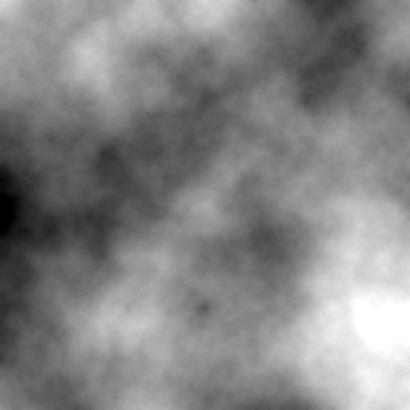

Algorithme de génération de height map, qui peut ensuite être utilisée pour créer des terrains procéduraux dans des jeux vidéos par exemple.

Voici une bonne vidéo expliquant l'algorithme :
[](https://www.youtube.com/watch?v=4GuAV1PnurU)

Conseil: commencez par travailler sur une image toute petite (e.g. 17x17), afin de bien voir les pixels et ce qu'il se passe.

> Vous pouvez créer une image noire avec
> ```cpp
> sil::Image image{17/*width*/, 17/*height*/};
> ```
> puis itérer sur les pixels pour les colorer.

#### ⭐⭐ Colorer la height map

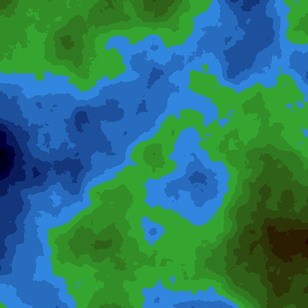

Appliquez un dégradé en couleur en fonction du niveau de gris de la height map.
> Avec `glm::mix(color1, color2, pourcentage);` vous pouvez faire un mélange entre deux couleurs données.

<details><summary>Indice</summary>

Essayez par exemple de faire un dégradé de bleu du sombre au clair quand le niveau de gris est entre 0 et 0.5, et un autre dégradé entre du vert et du marron quand le niveau de gris est entre 0.5 et 1.
</details>

### Vous pouvez implémenter vos propres effets !