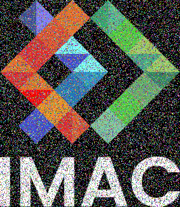

# 🐣 S1 | Prog: Workshop (Solution)

- [📅 Planning](#-planning)
  - [Lundi](#lundi)
    - [Prof 9h30-12h45 (pause 11h00-11h15)](#prof-9h30-12h45-pause-11h00-11h15)
    - [Élève](#élève)
  - [Mardi](#mardi)
    - [Matin 9h30-12h45 (pause 11h00-11h15)](#matin-9h30-12h45-pause-11h00-11h15)
      - [Prof](#prof)
      - [Élève](#élève-1)
    - [Aprèm](#aprèm)
      - [Prof 13h45-17h (pause 15h15-15h30)](#prof-13h45-17h-pause-15h15-15h30)
      - [Élève](#élève-2)
  - [Mercredi](#mercredi)
    - [Prof 9h30-10h30](#prof-9h30-10h30)
    - [Élève](#élève-3)
  - [Jeudi](#jeudi)
    - [Prof 9h30-10h30](#prof-9h30-10h30-1)
    - [Élève](#élève-4)
  - [Vendredi](#vendredi)
    - [Matin 9h30-10h30](#matin-9h30-10h30)
      - [Prof](#prof-1)
      - [Élève](#élève-5)
    - [Aprèm 13h45-17h (pause 15h15-15h30)](#aprèm-13h45-17h-pause-15h15-15h30)
- [📝 Sujet](#-sujet)
  - [Exercices à faire](#exercices-à-faire)
  - [Rapport](#rapport)
  - [Soutenance](#soutenance)
  - [Détails techniques](#détails-techniques)
- [💻 Exercices](#-exercices)
  - [⭐ Ne garder que le vert](#-ne-garder-que-le-vert)
  - [⭐ Noir \& Blanc](#-noir--blanc)
  - [⭐ Channels swap](#-channels-swap)
  - [⭐ Négatif](#-négatif)
  - [⭐⭐ Luminosité](#-luminosité)
  - [⭐⭐ Miroir](#-miroir)
  - [⭐⭐ Rotation de 90°](#-rotation-de-90)
  - [⭐⭐ Color glitch](#-color-glitch)
  - [⭐⭐⭐ Position glitch](#-position-glitch)
  - [⭐⭐⭐ Vortex](#-vortex)
  - [⭐⭐ RGB split](#-rgb-split)
  - [⭐ Dessiner un dégradé](#-dessiner-un-dégradé)
  - [⭐⭐ Dessiner un disque](#-dessiner-un-disque)
    - [⭐ Dessiner un cercle](#-dessiner-un-cercle)
    - [⭐⭐⭐ Dessiner une rosace](#-dessiner-une-rosace)
  - [⭐⭐⭐ Dessiner la fractale de Mandelbrot](#-dessiner-la-fractale-de-mandelbrot)
  - [⭐⭐⭐⭐⭐ K-means : trouver les couleurs les plus présentes dans une image](#-k-means--trouver-les-couleurs-les-plus-présentes-dans-une-image)
  - [⭐⭐⭐⭐ Convolutions](#-convolutions)
    - [⭐⭐ Flou gaussien](#-flou-gaussien)
    - [⭐⭐ Flou bokeh (appareil photo)](#-flou-bokeh-appareil-photo)
    - [⭐⭐ Separable filter](#-separable-filter)
      - [⭐⭐ Difference of gaussians](#-difference-of-gaussians)
  - [⭐⭐⭐(⭐) Histogram Equalization](#-histogram-equalization)
  - [⭐⭐⭐⭐ Affichage de l'histogramme](#-affichage-de-lhistogramme)
  - [⭐⭐ Effet Sépia](#-effet-sépia)
  - [Feel free to implement your own effects!](#feel-free-to-implement-your-own-effects)
  - [⭐⭐⭐⭐⭐ Filtre de Kuwahara (effet peinture)](#-filtre-de-kuwahara-effet-peinture)
  - [⭐⭐⭐ Color palette dithering](#-color-palette-dithering)
  - [⭐⭐⭐ Tramage](#-tramage)
  - [⭐⭐⭐⭐ Pixel sorting](#-pixel-sorting)
  - [⭐⭐⭐⭐ Diamond Square](#-diamond-square)
  - [⭐⭐⭐⭐ Flood Fill](#-flood-fill)
  - [⭐⭐⭐⭐⭐ Canny Edge Detection](#-canny-edge-detection)
  - [⭐⭐ Mosaic](#-mosaic)
    - [⭐⭐⭐ Mosaic flip](#-mosaic-flip)
  - [⭐⭐⭐⭐⭐ Ray Tracing](#-ray-tracing)


## 📅 Planning

### Lundi

#### Prof 9h30-12h45 (pause 11h00-11h15)

- [ ] Présentation de moi
- [ ] Présentation du projet
  - [ ] C'est quoi le sujet? -> faire des effets sur les images, comme on peut en trouver dans photoshop etc, filtre insta etc
  - [ ] Par groupe de 2, et 1 groupe de 3 si impair
  - [ ] Evaluation: min 1 exo de niveau 3 ou +, et autant du reste que possible. Montrez moi juste que vous êtes investies, 4h d'autonomie par jour c'est très bien. Posez un max de question, quand vous êtes bloquées et/ou par curiosité.
  - [ ] Je vous encourage à dans un premier temps essayer de faire chaque exercice sans regarder les indices, ni chercher sur internet / ChatGPT. Essayez de résoudre le problème par vous-même, ça aide à mieux le comprendre, puis apprécier et retenir la solution. + si vous réussissez seul.e, giga satisfaction. Les exos sont "faciles", c'est fait pour. Bien sûr que ChatGPT peut les résoudre, mais vous n'apprendrez rien si vous n'essayez pas par vous même. Et plutôt que ChatGPT, demandez moi en premier si possible, je pourrai mieux vous aiguiller / expliquez juste comme il faut pour que vous appreniez un max. Ou sinon demandez à vos camarades en deuxième solution (+ c'est un bon exercice d'expliquer donc vous rendez service à la fois à vous-même et à elleux)   
- [ ] Présentation de la lib
  - [ ] Parler de la représentation des couleurs en vec3 avec des valeurs de 0 à 1
  - [ ] Mentionner que pour faire les choses bien il ne faudrait pas travailler en sRGB mais dans un espace perceptuellement correct (CIELab, Oklab)
  - [ ] Mentionner que la lib n'est pas un exemple de la meilleure API de l'univers, elle est minimaliste pour les forcer à écrire un max de code, se rendre compte des problèmes qui peuvent survenir, pas trop leur mâcher le travail. (Par exemple, on devrait permettre de gérer un wrap mode, et faire les conversions d'espace de couleur automatiquement, et pouvoir itérer sur les lignes ou sur les colonnes, et aussi le fait que le chemins soient relatifs au dossier contenant le CMakeLists.txt c'est atroce en production)

#### Élève

- [ ] Création du groupe : binôme obligatoirement (et 1 trinôme dans la classe si impair)
- [ ] Prise en main de la lib
- [ ] Quelques exercices de niveau 1 (⭐) et/ou 2 (⭐⭐)

### Mardi

#### Matin 9h30-12h45 (pause 11h00-11h15)

##### Prof

- [ ] Présentation de git

##### Élève

- [ ] Création du git
- [ ] Test et prise en main de git (l'un push quelque chose et l'autre le pull par exemple)
- [ ] Mettre sur le repository les exercices que vous avez fait hier

#### Aprèm

##### Prof 13h45-17h (pause 15h15-15h30)

- [ ] Présentation des algos avancés (niveau 3 ou plus ⭐⭐⭐)
- [ ] Conseil : faites un fichier à part pour votre algo avancé, car il y aura probablement plusieurs fonctions intermédiaires à écrire, et peut-être des structs aussi.

##### Élève

- [ ] Choix de l'algo que vous allez implémenter (niveau 3 ou plus ⭐⭐⭐)
- [ ] Commencer à vous renseigner sur votre algo avancé, à l'implémenter

### Mercredi

#### Prof 9h30-10h30

- [ ] Si besoin, point de rappel sur une notion mal acquise.
- [ ] Passer voir les groupes, regarder l'algo avancé qu'iels ont choisi.


#### Élève

- [ ] Avancer sur l'algo avancé

### Jeudi

#### Prof 9h30-10h30

- [ ] Si besoin, point de rappel sur une notion mal acquise.
- [ ] Passer voir les groupes et décider qui présente quel algo. Possibilité que plusieurs groupes se mettent ensemble pour présenter leur algo si tout le monde a envie de passer.

#### Élève

- [ ] Finir votre algo avancé


### Vendredi

#### Matin 9h30-10h30

##### Prof

- [ ] Présentation de Markdown pour l'écriture du rapport
  - [ ] Extension VSCode, et comment elle permet de générer une Table of Content
  - [ ] Syntaxe basique (titres, gras, italique), et si voulez vous pouvez aller voir comment [le document que vous êtes en train de lire](TODO mettre le lien du sujet qui est sur le git) est écrit, c'est du markdown !
  - [ ] Mettre des images (s'assurer du coup que leur dossier output soit à la racine du repo, et soit commit)
  - [ ] Vous pouvez mettre du html si vous voulez faire des trucs + avancés.

##### Élève

- [ ] Écriture du rapport. (Vous avez jusqu'à lundi matin pour les rendre).
- [ ] Préparation de la présentation pour celleux concerné.es

#### Aprèm 13h45-17h (pause 15h15-15h30)

- [ ] Présentations


## 📝 Sujet

### Exercices à faire

Faites un maximum de chose, et au minimum un exercice de niveau 3 ou plus (⭐⭐⭐). Vous êtes aussi les bienvenu.es pour inventer vos propres effets !

### Rapport

A faire en Markdown obligatoirement (si vous ne connaissez pas c'est l'occasion de découvrir, c'est super utile).

A mettre directement en tant que readme à la racine du repo.

Faite une section par exercice que vous avez fait. Montrez une image avant et après application de l'effet (comme c'est fait dans l'énoncé des exercices). Si vous jugez cela utile, vous pouvez mettre un petit texte expliquant des spécificités de l'algo que vous avez implémenté. (C'est surtout intéressant si vous avez fait des algos qui ne sont pas listés dans le sujet, et pour votre algo 3+).

### Soutenance

Présentez un des algos avancés que vous avez fait, en 5 minutes. C'est de la vulgarisation, il faut que tous vos camarades puissent comprendre, au moins dans les grandes lignes.

> Est-ce que c'est utile ? Ca prend pas mal de temps. Mais de l'autre côté c'est un bon exercice qui force à avoir bien compris l'algo, et ça permet aux autres de voir les algos qu'iels n'ont pas implémenté. Ou sinon, je demande juste aux groupes les plus chauds de faire une présentation, comme ça c'est pas trop long, et on voit juste une fois chaque algo. Et on peut prendre + de temps pour chaque présentation (même pas besoin de limiter le temps, iels font comme bon leur semble).

### Détails techniques

Nous utiliserons la librairie *sil* pour lire, éditer et re-sauvegarder les images. Elle est très simple à utiliser et n'expose que le minimum nécessaire. Vous pouvez trouver sa documentation [sur GitHub](https://github.com/JulesFouchy/Simple-Image-Lib/tree/main#usage).

## 💻 Exercices

- Leur dire de travailler sur une image pas trop grande, pour que le rendu soit quasi-instantané. (Par exemple l'image par défaut fournie dans le projet est très bien. Mais il faut leur fournir aussi une photo, certains effets ne marchent pas bien sur une image en flat design).
- Leur dire d'afficher l'image output à côté dans VSCode pour facilement voir le résultat


### ⭐ Ne garder que le vert


<details><summary>Indice</summary>
Mettre le rouge et le bleu à 0.
</details>

### ⭐ Noir & Blanc


N'hésitez pas à **aller chercher la formule sur internet** si besoin !

### ⭐ Channels swap


Par exemple, échangez le canal rouge et le canal bleu.

### ⭐ Négatif


### ⭐⭐ Luminosité

|   |   |  |
|---|----|----|
| Image originale | Après éclaircissement | Après assombrissement |

<details><summary>Indice</summary>
On voudrait des courbes comme celles-ci, qui diminuent tous les nombres entre 0 et 1 (c-à-d assombrissent), ou les augmentent (c-à-d éclaircissent), tout en gardant 0 à 0 et 1 à 1 (afin de garder la plage dynamique de l'image, pour conserver des noirs purs et des blancs purs).


<details><summary>Indice 2</summary>
Les fonctions puissance font exactement ce qu'on veut!<br/>
La preuve: <a src="https://www.desmos.com/calculator/c3ztk51mng">https://www.desmos.com/calculator/c3ztk51mng</a>
</details>
</details>

### ⭐⭐ Miroir


Symétrie par rapport à l'axe Y (vertical).

### ⭐⭐ Rotation de 90°


La formule générique pour un angle quelconque est un peu plus compliquée, mais pour 90° il y a une formule vraiment simple, essayez de la trouver !

### ⭐⭐ Color glitch



Remplacer quelques pixels au hasard par une couleur aléatoire.

Pour obtenir des nombres aléatoires, includez le fichier `"random.hpp"` et utilisez soit `random_int(min, max)` soit `random_float(min, max)`. Si vous voulez que votre programme utilise les mêmes nombres aléatoires à chaque fois que vous l'utilisez, vous pouvez définir une seed avec `set_random_seed(0)` au début de votre `main()` (vous pouvez passer n'importe quel nombre autre que 0, ça définira quels seront les nombres générés par les fonctions random).

### ⭐⭐⭐ Position glitch


Pour obtenir des nombres aléatoires, includez le fichier `"random.hpp"` et utilisez soit `random_int(min, max)` soit `random_float(min, max)`. Si vous voulez que votre programme utilise les mêmes nombres aléatoires à chaque fois que vous l'utilisez, vous pouvez définir une seed avec `set_random_seed(0)` au début de votre `main()` (vous pouvez passer n'importe quel nombre autre que 0, ça définira quels seront les nombres générés par les fonctions random).

<details><summary>Indice</summary>
Prendre un rectangle de pixels et l'intervertir avec un autre rectangle de pixels, ailleurs dans l'image. Faire ça plusieurs fois.
</details>

### ⭐⭐⭐ Vortex


<details><summary>Indice</summary>
Chaque pixel subit une rotation, de plus en plus importante au fur et à mesure qu'on s'éloigne du centre.
</details>

### ⭐⭐ RGB split


⚠️ Créez une nouvelle image et travaillez sur celle-ci. Il ne faut pas modifier l'image originale pendant que vous bouclez pour appliquer l'effet, sinon certains pixels n'utiliseront pas la bonne couleur de l'image originale, mais plutôt la couleur déjà modifiée par un pixel précédent, ce qui pourrait vous donner ce genre de rendu moins intéressant :


### ⭐ Dessiner un dégradé


Vous pouvez créer une image noire avec
```cpp
sil::Image image{300/*width*/, 200/*height*/};
```
puis itérer sur les pixels pour les colorer.

### ⭐⭐ Dessiner un disque


Vous pouvez créer une image noire avec
```cpp
sil::Image image{500/*width*/, 500/*height*/};
```

<details><summary>Indice</summary>
Ensuite, à vous de parcourir les pixels et de les colorier ou non en fonction de si ils sont à l'intérieur du disque. La fonction prendra en paramètre le centre et le rayon du disque.
</details>

#### ⭐ Dessiner un cercle


En reprenant et modifiant légèrement votre code pour le disque, écrivez le code qui donne un cercle. (Son contour aura une épaisseur donnée `thickness`).

#### ⭐⭐⭐ Dessiner une rosace


Maintenant que vous savez dessiner un cercle, dessinez-en plusieurs sur la même image, à des positions bien choisies, de sorte à dessiner une rosace.
(PS: il va surement falloir faire de la trigo!)

### ⭐⭐⭐ Dessiner la fractale de Mandelbrot


<details><summary>Indice</summary>
Définir un nombre max d'itérations, itérer `z <- z * z + c` jusqu'à ce qu'on dépasse ce nombre d'itérations ou que la norme de z soit > 2, puis assigner une couleur en fonction du nombre d'itérations qu'on a fait avant de sortir de la boucle.
</details>

### ⭐⭐⭐⭐⭐ K-means : trouver les couleurs les plus présentes dans une image

|   |  |   |   |
|---|----|----|----|
| Originale | 2 couleurs | 3 couleurs | 16 couleurs |

Trouvez les k couleurs les plus représentatives de l'image, puis assignez à chaque pixel la couleur dont il est le plus proche parmi les k.

Voici une bonne vidéo expliquant l'algorithme :

[](https://www.youtube.com/watch?v=yR7k19YBqiw)

Pour obtenir des nombres aléatoires, includez le fichier `"random.hpp"` et utilisez soit `random_int(min, max)` soit `random_float(min, max)`. Si vous voulez que votre programme utilise les mêmes nombres aléatoires à chaque fois que vous l'utilisez, vous pouvez définir une seed avec `set_random_seed(0)` au début de votre `main()` (vous pouvez passer n'importe quel nombre autre que 0, ça définira quels seront les nombres générés par les fonctions random).

### ⭐⭐⭐⭐ Convolutions


Box blur

#### ⭐⭐ Flou gaussien

#### ⭐⭐ Flou bokeh (appareil photo)


#### ⭐⭐ Separable filter

https://youtu.be/SiJpkucGa1o

##### ⭐⭐ Difference of gaussians

https://youtu.be/5EuYKEvugLU

Ne faire que le début ça suffit, jusqu'à 4m09.

### ⭐⭐⭐(⭐) Histogram Equalization

|   |   |
|---|----|
| Avant | Après |

Amélioration du contraste, en calculant la luminosité min et max, et en appliquant une transformation qui va mapper le plus sombre à 0 et le plus clair à 1.
(PS: testez avec l'image "images/photo_faible_contraste.jpg", vous verrez bien l'intérêt de l'effet.)

### ⭐⭐⭐⭐ Affichage de l'histogramme

S'inspirer de Lightroom. Potentiellement split les histogrammes R, G et B

### ⭐⭐ Effet Sépia

### Feel free to implement your own effects!

### ⭐⭐⭐⭐⭐ Filtre de Kuwahara (effet peinture)


https://youtu.be/LDhN-JK3U9g

(Juste la version simple, qui est expliquée entre 3:11 et 3:30, suffit. Si vous voulez aller plus loin, vous êtes les bienvenu.es bien sûr 😉)

### ⭐⭐⭐ Color palette dithering

https://youtu.be/8wOUe32Pt-E

### ⭐⭐⭐ Tramage


Vous pouvez lire [ce super article](https://surma.dev/things/ditherpunk/) sur le tramage (a.k.a. *dithering* en anglais).

Sur l'image ci-dessus j'ai utilisé de l'*ordered dithering* avec une matrice de Bayer 4x4 (a.k.a. de niveau 1). Tout est expliqué dans l'article ci-dessus ! (Plus précisément, j'ai repris la matrice et le code depuis [cet autre article](https://medium.com/the-bkpt/dithered-shading-tutorial-29f57d06ac39).)

### ⭐⭐⭐⭐ Pixel sorting


Voici une bonne vidéo expliquant l'algorithme (vous pouvez ignorer le début spécifique à Processing où on voit comment afficher l'image) :

[](https://www.youtube.com/watch?v=JUDYkxU6J0o)

Ensuite, au lieu de trier tous les pixels de l'image, triez par colonne (ou par ligne), pour un effet plus joli.

Pour trier un tableau, vous pouvez utiliser [`std::sort`](https://www.geeksforgeeks.org/sort-c-stl/).

Plutôt que d'utiliser `get_pixel()` vous avez probablement intérêt à utiliser à utiliser `pixels()` pour récupérer le tableau contenant tous les pixels de l'image.

Pour obtenir des nombres aléatoires, includez le fichier `"random.hpp"` et utilisez soit `random_int(min, max)` soit `random_float(min, max)`. Si vous voulez que votre programme utilise les mêmes nombres aléatoires à chaque fois que vous l'utilisez, vous pouvez définir une seed avec `set_random_seed(0)` au début de votre `main()` (vous pouvez passer n'importe quel nombre autre que 0, ça définira quels seront les nombres générés par les fonctions random).

### ⭐⭐⭐⭐ Diamond Square

https://youtu.be/4GuAV1PnurU

### ⭐⭐⭐⭐ Flood Fill

### ⭐⭐⭐⭐⭐ Canny Edge Detection

### ⭐⭐ Mosaic


<details><summary>Indice</summary>
You can use a modulo (`%`) somewhere.
</details>

#### ⭐⭐⭐ Mosaic flip

Flip every other image:


### ⭐⭐⭐⭐⭐ Ray Tracing

A minima une sphère et un shading basique.

Pour calculer le shading pour une sphère :
```cpp
glm::vec3 const light_direction = glm::normalize(glm::vec3{1.f, 3.f, 10.f});
glm::vec3 const light_color = glm::vec3(1.f, 1.f, 0.f);   // Yellow for the sun
glm::vec3 const ambient_color = glm::vec3(0.f, 0.f, 1.f); // Slight blue for the sky

glm::vec3 const normal = glm::normalize(intersection_point_with_the_sphere - center_of_the_sphere); // Attention cette formule ne marche que parce que c'est une sphère!
float const light_intensity = std::clamp(glm::dot(light_direction, normal), 0.f, 1.f);
glm::vec3 const final_color = ambient_color + light_intensity * light_color;
```

Voici une bonne vidéo expliquant les maths dont vous aurez besoin :

[](https://www.youtube.com/watch?v=4NshnkzOdI0)