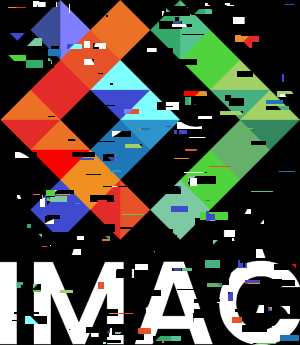

# 🐣 S1 | Prog: Workshop (Solution)

- [📅 Planning](#-planning)
  - [Lundi](#lundi)
    - [Prof](#prof)
    - [Élève](#élève)
  - [Mardi](#mardi)
    - [Matin](#matin)
      - [Prof](#prof-1)
      - [Élève](#élève-1)
    - [Aprèm](#aprèm)
      - [Prof](#prof-2)
      - [Élève](#élève-2)
  - [Mercredi](#mercredi)
    - [Prof](#prof-3)
    - [Élève](#élève-3)
  - [Jeudi](#jeudi)
    - [Prof](#prof-4)
    - [Élève](#élève-4)
  - [Vendredi](#vendredi)
    - [Matin](#matin-1)
      - [Prof](#prof-5)
      - [Élève](#élève-5)
    - [Aprèm](#aprèm-1)
- [💻 Exercices](#-exercices)
  - [⭐ Noir \& Blanc](#-noir--blanc)
  - [⭐ Channels swap](#-channels-swap)
  - [⭐⭐ Conversions RGB ⇔ HSL](#-conversions-rgb--hsl)
    - [⭐ Hue shift](#-hue-shift)
    - [⭐ Désaturation](#-désaturation)
    - [⭐ Assombrissement / Éclaircissement](#-assombrissement--éclaircissement)
  - [⭐⭐ Contraste](#-contraste)
  - [⭐⭐ Luminosité](#-luminosité)
  - [⭐⭐ Miroir](#-miroir)
  - [⭐⭐ Color glitch](#-color-glitch)
  - [⭐⭐⭐ Position glitch](#-position-glitch)
  - [⭐⭐⭐ Vortex](#-vortex)
  - [⭐⭐ RGB split](#-rgb-split)
  - [⭐⭐ Dessiner un disque](#-dessiner-un-disque)
    - [⭐ Dessiner un cercle](#-dessiner-un-cercle)
    - [⭐⭐ Dessiner une rosace](#-dessiner-une-rosace)
  - [⭐⭐⭐ Dessiner la fractale de Mandelbrot](#-dessiner-la-fractale-de-mandelbrot)
  - [⭐⭐⭐ K-means : trouver les couleurs les plus présentes dans une image](#-k-means--trouver-les-couleurs-les-plus-présentes-dans-une-image)
  - [⭐⭐⭐ Convolutions](#-convolutions)
    - [⭐⭐ Flou gaussien](#-flou-gaussien)
    - [⭐⭐ Difference of gaussians](#-difference-of-gaussians)
    - [⭐⭐⭐ Histogram Equalization](#-histogram-equalization)
    - [⭐⭐⭐ Affichage de l'histogramme](#-affichage-de-lhistogramme)
  - [⭐⭐ Effet Sépia](#-effet-sépia)
  - [Feel free to implement your own effects!](#feel-free-to-implement-your-own-effects)
  - [⭐⭐⭐⭐ Kuwahara filter](#-kuwahara-filter)
  - [⭐⭐⭐ Color palette dithering](#-color-palette-dithering)
  - [⭐⭐⭐ Spatial dithering](#-spatial-dithering)
  - [⭐⭐⭐⭐ Pixel sorting](#-pixel-sorting)
  - [⭐⭐⭐⭐ Diamond Square](#-diamond-square)
  - [⭐⭐⭐⭐ Flood Fill](#-flood-fill)
  - [⭐⭐⭐⭐ Canny Edge Detection](#-canny-edge-detection)
  - [⭐⭐ Mosaic](#-mosaic)
  - [⭐⭐⭐⭐⭐ Ray Tracing](#-ray-tracing)
- [Rendu](#rendu)
  - [Exercices à faire](#exercices-à-faire)
  - [Rapport](#rapport)
  - [Soutenance](#soutenance)


## 📅 Planning

### Lundi

#### Prof

- [ ] Présentation du projet
- [ ] Présentation de la lib

#### Élève

- [ ] Création du groupe : binôme obligatoirement (et 1 trinôme dans la classe si impair)
- [ ] Prise en main de la lib
- [ ] Quelques exercices de niveau 1 (⭐), et 2 (⭐⭐) si vous vous sentez chaud

### Mardi

#### Matin

##### Prof

- [ ] Présentation de git

##### Élève

- [ ] Création du git
- [ ] Test et prise en main de git (l'un push quelque chose et l'autre le pull par exemple)
- [ ] Mettre sur le repository les exercices que vous avez fait hier

#### Aprèm

##### Prof

- [ ] Présentation des algos avancés (niveau 3 ou plus ⭐⭐⭐)
- [ ] Conseil : faites un fichier à part pour votre algo avancé, car il y aura probablement plusieurs fonctions intermédiaires à écrire, et peut-être des structs aussi.

##### Élève

- [ ] Choix de l'algo que vous allez implémenter (niveau 3 ou plus ⭐⭐⭐)
- [ ] Commencer à vous renseigner sur votre algo avancé, à l'implémenter

### Mercredi

#### Prof

- [ ] Si besoin, point de rappel sur une notion mal acquise.
- [ ] Passer voir les groupes, regarder l'algo avancé qu'iels ont choisi.


#### Élève

- [ ] Avancer sur l'algo avancé

### Jeudi

#### Prof

- [ ] Si besoin, point de rappel sur une notion mal acquise.
- [ ] Passer voir les groupes et décider qui présente quel algo. Possibilité que plusieurs groupes se mettent ensemble pour présenter leur algo si tout le monde a envie de passer.

#### Élève

- [ ] Finir votre algo avancé


### Vendredi

#### Matin

##### Prof

- [ ] Présentation de Markdown pour l'écriture du rapport
  - [ ] Extension VSCode, et comment elle permet de générer une Table of Content
  - [ ] Syntaxe basique (titres, gras, italique), et si voulez vous pouvez aller voir comment [le document que vous êtes en train de lire](TODO mettre le lien du sujet qui est sur le git) est écrit, c'est du markdown !
  - [ ] Mettre des images (s'assurer du coup que leur dossier output soit à la racine du repo, et soit commit)

##### Élève

- [ ] Écriture du rapport. (Vous avez jusqu'à lundi matin pour les rendre).
- [ ] Préparation de la présentation pour celleux concerné.e.s

#### Aprèm

- [ ] Présentations


## 💻 Exercices

- Leur dire de travailler sur une image pas trop grande, pour que le rendu soit quasi-instantané. (Par exemple l'image par défaut fournie dans le projet est très bien).
- Leur dire d'afficher l'image output à côté dans VSCode pour facilement voir le résultat


### ⭐ Noir & Blanc

N'hésitez pas à **aller chercher la formule sur internet** si besoin !

### ⭐ Channels swap


Par exemple, échangez le canal rouge et le canal bleu.

### ⭐⭐ Conversions RGB ⇔ HSL

Vous pouvez reprendre les formules RGB → HSL et HSL → RGB [depuis cette page](https://www.easyrgb.com/en/math.php). Attention, iels considèrent que R, G et B vont entre 0 et 255, alors que pour nous ils vont de 0 à 1. Il faudra donc légèrement adapter les formules du site.

En elles-mêmes ces formules ne changent pas l'image, mais elles vous permettent d'implémenter facilement les effets suivants:

#### ⭐ Hue shift
#### ⭐ Désaturation
#### ⭐ Assombrissement / Éclaircissement

### ⭐⭐ Contraste

### ⭐⭐ Luminosité

### ⭐⭐ Miroir


Symétrie par rapport à l'axe Y (vertical).

### ⭐⭐ Color glitch

Remplacer quelques pixel au hasard par une couleur aléatoire.

### ⭐⭐⭐ Position glitch



Prendre un rectangle de pixels et l'intervertir avec un autre rectangle de pixels, ailleurs dans l'image. Faire ça plusieurs fois.

### ⭐⭐⭐ Vortex


### ⭐⭐ RGB split


⚠️ Créez une nouvelle image et travaillez sur celle-ci. Il ne faut pas modifier l'image originale pendant que vous bouclez pour appliquer l'effet, sinon certains pixels n'utiliseront pas la bonne couleur de l'image originale, mais plutôt la couleur déjà modifiée par un pixel précédent, ce qui pourrait vous donner ce genre de rendu moins intéressant :


### ⭐⭐ Dessiner un disque

Vous pouvez créer une image noire avec
```cpp
sil::Image image{500/*width*/, 500/*height*/};
```

Ensuite, à vous de parcourir les pixels et de les colorier ou non en fonction de si ils sont à l'intérieur du cercle.

#### ⭐ Dessiner un cercle

En reprenant et modifiant légèrement votre code pour le disque, écrivez le code qui donne un cercle. (Son contour aura une épaisseur donnée `thickness`).

#### ⭐⭐ Dessiner une rosace

Maintenant que vous savez dessiner un cercle, dessinez-en plusieurs sur la même image, à des positions différentes, de sorte à dessiner une rosace.

### ⭐⭐⭐ Dessiner la fractale de Mandelbrot


### ⭐⭐⭐ K-means : trouver les couleurs les plus présentes dans une image

Trouvez les k couleurs les plus représentatives de l'image, puis assignez à chaque pixel la couleur dont il est le plus proche parmi les k.

Voici une bonne vidéo expliquant l'algorithme :

[](https://www.youtube.com/watch?v=yR7k19YBqiw)

### ⭐⭐⭐ Convolutions

#### ⭐⭐ Flou gaussien

#### ⭐⭐ Difference of gaussians

https://youtu.be/5EuYKEvugLU

#### ⭐⭐⭐ Histogram Equalization

Amélioration du contraste, en calculant la luminosité min et max, et en appliquant une transformation qui va mapper le plus sombre à 0 et le plus clair à 1.
(PS: ne testez pas avec l'image imac, le rendu ne sera pas intéressant, prenez plutôt une photo peu contrastée (TODO: leur donner une image test))

#### ⭐⭐⭐ Affichage de l'histogramme

S'inspirer de Lightroom. Potentiellement split les histogrammes R, G et B

### ⭐⭐ Effet Sépia

### Feel free to implement your own effects!

### ⭐⭐⭐⭐ Kuwahara filter

https://youtu.be/LDhN-JK3U9g

(Juste la version simple, qui est expliquée à 3:11, suffit. Si vous voulez aller plus loin, vous êtes les bienvenu.es bien sûr 😉)

### ⭐⭐⭐ Color palette dithering

https://youtu.be/8wOUe32Pt-E

### ⭐⭐⭐ Spatial dithering

### ⭐⭐⭐⭐ Pixel sorting


Voici une bonne vidéo expliquant l'algorithme (vous pouvez ignorer le début spécifique à Processing où on voit comment afficher l'image) :

[](https://www.youtube.com/watch?v=JUDYkxU6J0o)

Ensuite, au lieu de trier tous les pixels de l'image, triez par colonne (ou par ligne), pour un effet plus joli.

Pour trier un tableau, vous pouvez utiliser [`std::sort`](https://www.geeksforgeeks.org/sort-c-stl/).

### ⭐⭐⭐⭐ Diamond Square

https://youtu.be/4GuAV1PnurU

### ⭐⭐⭐⭐ Flood Fill

### ⭐⭐⭐⭐ Canny Edge Detection

### ⭐⭐ Mosaic

### ⭐⭐⭐⭐⭐ Ray Tracing

A minima une sphère et un shading basique.

Pour calculer le shading pour une sphère :
```cpp
glm::vec3 const light_direction = glm::normalize(glm::vec3{1.f, 3.f, 10.f});
glm::vec3 const light_color = glm::vec3(1.f, 1.f, 0.f);   // Yellow for the sun
glm::vec3 const ambient_color = glm::vec3(0.f, 0.f, 1.f); // Slight blue for the sky

glm::vec3 const normal = glm::normalize(intersection_point_with_the_sphere - center_of_the_sphere); // Attention cette formule ne marche que parce que c'est une sphère!
float const light_intensity = std::clamp(glm::dot(light_direction, normal), 0.f, 1.f);
glm::vec3 const final_color = ambient_color + light_intensity * light_color;
```

Voici une bonne vidéo expliquant les maths dont vous aurez besoin :

[](https://www.youtube.com/watch?v=4NshnkzOdI0)

## Rendu

### Exercices à faire

Faites un maximum de chose, et au minimum un exercice de niveau 3 ou plus (⭐⭐⭐).

### Rapport

A faire en Markdown obligatoirement (si vous ne connaissez pas c'est l'occasion de découvrir, c'est super utile).

Faite une section par exercice que vous avez fait. Montrez une image avant et après application de l'effet (comme c'est fait dans l'énoncé des exercices). Si vous jugez cela utile, vous pouvez mettre un petit texte expliquant des spécificités de l'algo que vous avez implémenté. (C'est surtout intéressant si vous avez fait des algos qui ne sont pas listés dans le sujet).

### Soutenance

Présentez un des algos avancés que vous avez fait, en 5 minutes. C'est de la vulgarisation, il faut que tous vos camarades puissent comprend, au moins dans les grandes lignes.

> Est-ce que c'est utile ? Ca prend pas mal de temps. Mais de l'autre côté c'est un bon exercice qui force à avoir bien compris l'algo, et ça permet aux autres de voir les algos qu'iels n'ont pas implémenté. Ou sinon, je demande juste aux groupes les plus chauds de faire une présentation, comme ça c'est pas trop long, et on voit juste une fois chaque algo. Et on peut prendre + de temps pour chaque présentation (même pas besoin de limiter le temps, iels font comme bon leur semble).
